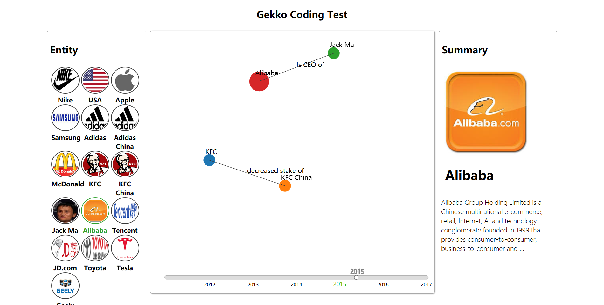

# Gekko Coding Test

## 目的分析

在分析了coding test的任务要求和给定数据之后，我自己给出了这样一种用户场景---对于如今的金融领域，大公司之间的各种关系，事件往往对整个金融圈造成巨大的影响，用户希望在时间，关系层面上看到金融圈的各公司，人物，甚至国家之间的金融事件的发展状况。故需要创建一种简单，直观的图表来呈现各公司之间的关系，并在时间上对这种关系的发展情况给予划分。

## 图表设计

- [x] force directed graph
- [x] timeline slider
- [x] 显示实体简介
- [x] 对用户感兴趣的实体进行突出显示

图表设计中，遵守coding test基本要求的`force directed graph` 和 额外要求的 `timeline slider` ，并对一些用户体验的细节进行了整改

除此之外，考虑到用户对实体本身的兴趣，可以通过点击左侧的图表查看公司的简介，在图表中的时间线会用绿色字体和加大字体显示出该公司发生事件的年代，同时考虑到用户能在数量巨大的实体点中找到感兴趣的公司，对选中的公司的实体点的大小进行了增大。

## 实现原理

使用原生js,html,css

所有dom操作都是基于d3js进行